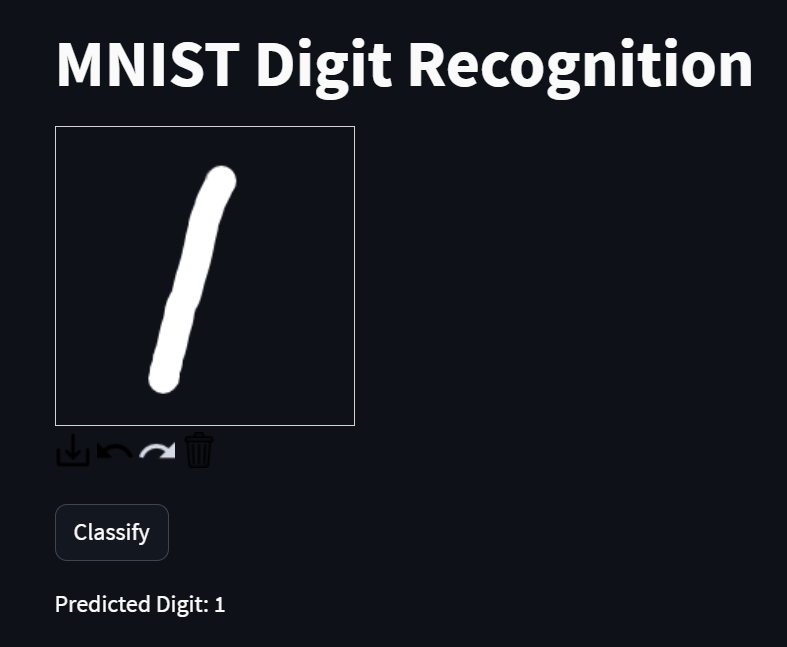
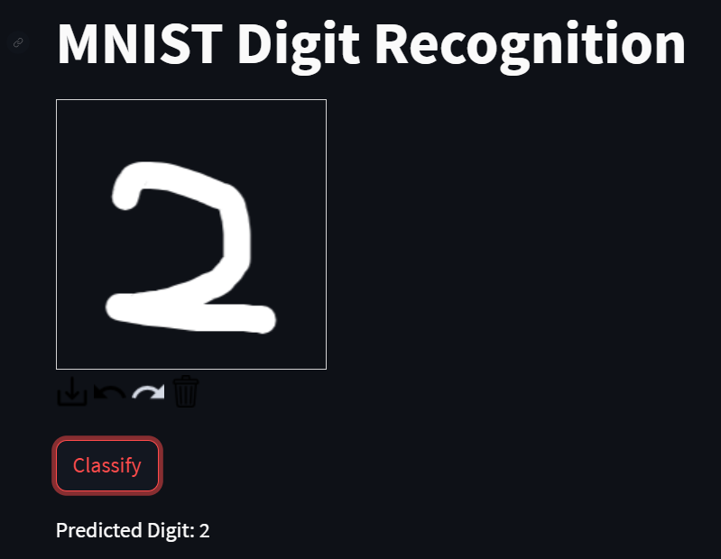
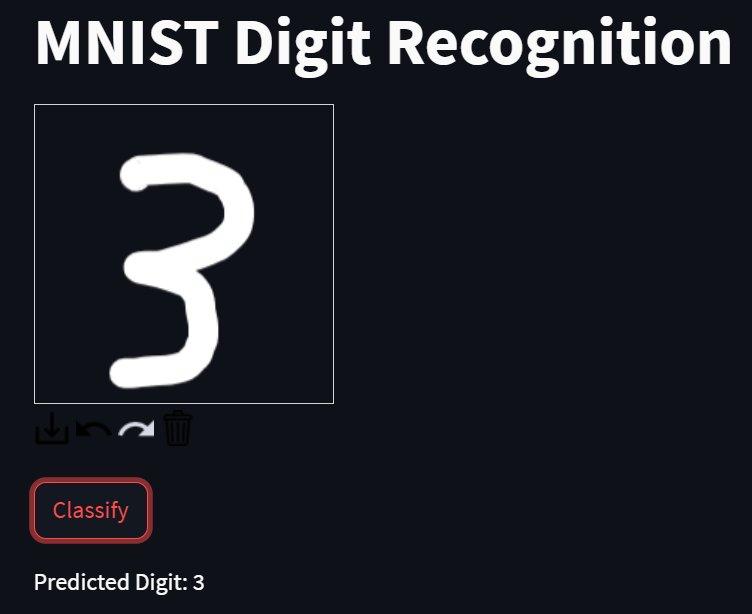
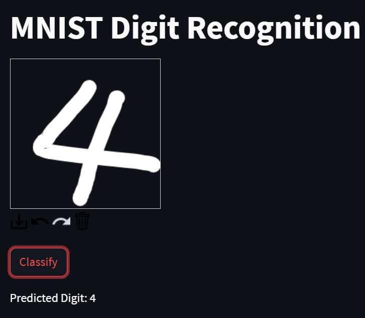
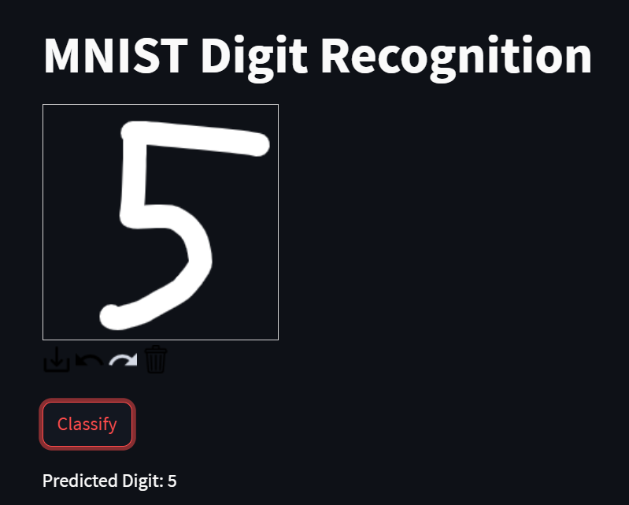
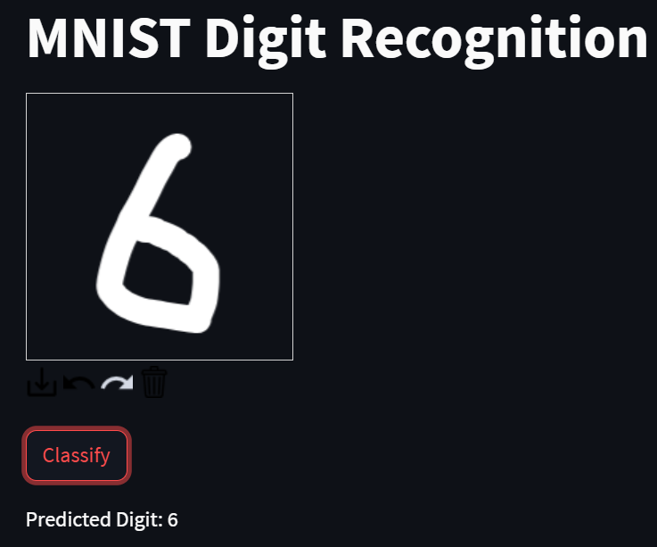
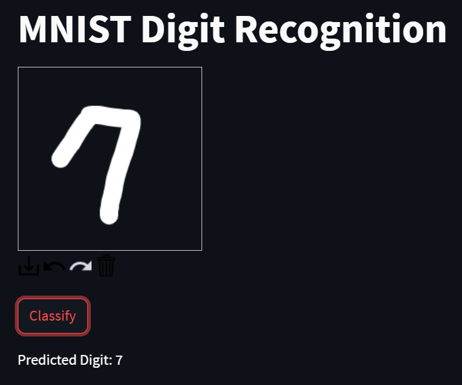
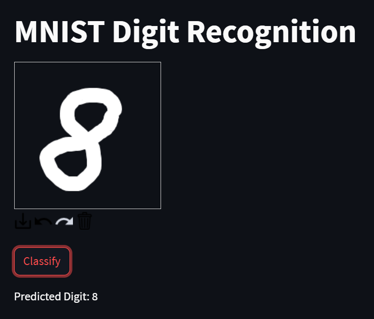
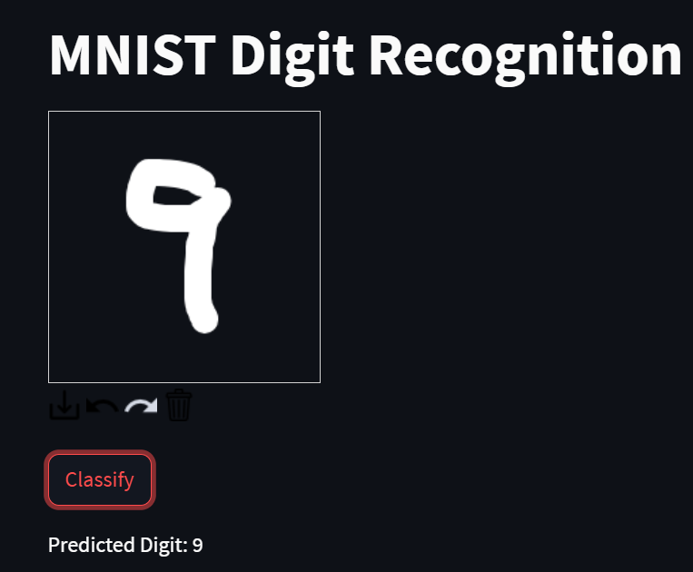

# MNIST Digit Recognition

   

This is a Streamlit web application for recognizing hand-drawn digits from 0 to 9 using a pre-trained deep learning model. Users can draw a digit on the canvas provided, and the application will classify and display the predicted digit.

## Table of content

- [MNIST Digit Recognition](#mnist-digit-recognition)
  - [Table of content](#table-of-content)
  - [Installation](#installation)
  - [Usage](#usage)
  - [Contact](#contact)

## Installation

```bash
pip install opencv-contrib-python
pip install opencv-python
pip install tensorflow==2.13.0
pip install streamlit
pip install streamlit-drawble-canvas
```

## Usage

1. Execute "streamlit run deploy_model.py" command.
1. Click on the Network URL link, which will open in the web browser.
1. Use the canvas to draw a single-digit number (0-9). The canvas is set to a default size of 200x200 pixels and allows freehand drawing.
1. After drawing your digit, click the "Classify" button below the canvas to initiate the recognition process.
1. The application will display the predicted digit based on your drawing.
   
   
   
   
   
   
   
   
   

## Contact

[](https://github.com/YunTW) [](https://www.linkedin.com/in/yuntw/) [](terrell60813@gmail.com)
